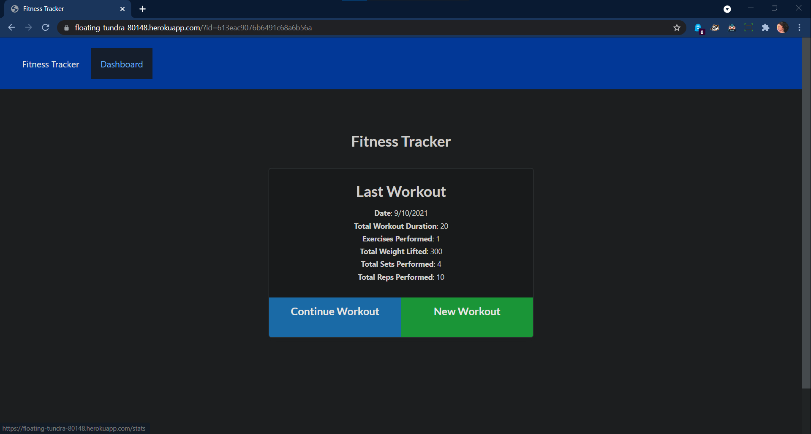
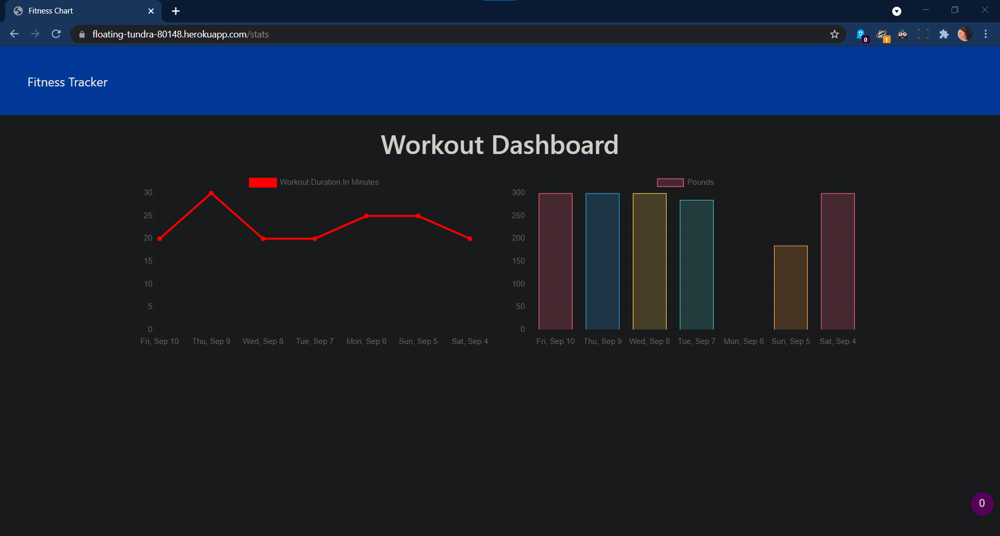

# 18 Nosql: Workout Tracker

## Table of Contents

- [Description](#description)
- [Installation](#installation)
- [Usage](#usage)
- [Screenshots](#screenshots)
- [Heroku Link](#heroku-link)
- [Contact](#contact)

## Description

An app used for tracking workout sessions and exercises for each workout, including distance, duration and reps.

## Installation

This app requires the following dependencies: 
- express
- mongoose
- dotenv
- morgan

## Usage

In the terminal, from the root folder, run with commands "npm i", "npm run seed" and "npm start". Then from a browser navigate to "http://localhost:3000".

## Screenshots

## Heroku Link
https://floating-tundra-80148.herokuapp.com/?id=613eac9076b6491c68a6b56a

## Contact

Mehalet KesateBirhan  
Github: https://github.com/MehaletKB 
email: tatybcoding@gmail.com
